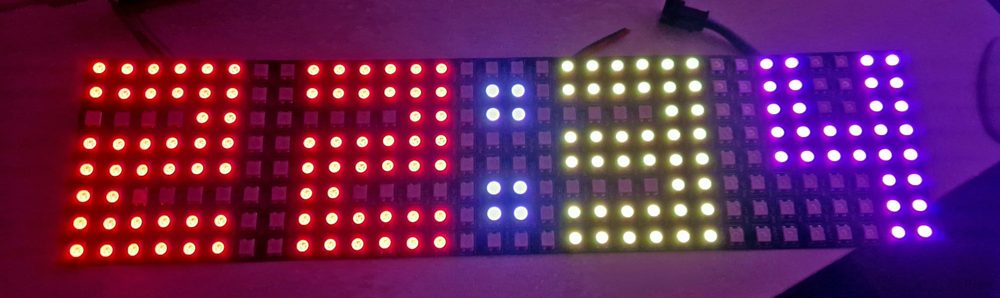

# Pico-W-LED-Matrix
MicroPython script for showing actual time on WS2812b LED matrix (32x8) with Raspberry Pi Pico W

   
   
PIN GP0 (1):      DATA IN   
PIN VBUS (40):    +5V   
PIN GROUND (38):  GROUND
   
Simple script with Wifi connected Pico W device to check actual time from NTP server. Then it is showing on LED WS2812b matrix (cheap AliExpress).
Digital numbers can be easily changed with better font style, just ensure that numbers are 6 points columns and 8 point rows (6x8) for these settings.

### Update 01/2024
Light sensor (photo resistor) support added.
Connected on 31 (GP26) and 33 (GND) PIN. Then added 10k resistor between PIN 35 and 31. With more ambient light the brightness is stronger, in the dark is weaker.    

PIN GP26 (31):    Photoresistor + 10k resistor   
PIN GROUND (33):  Photoresistor   
PIN ADF (35):     10k resistor

